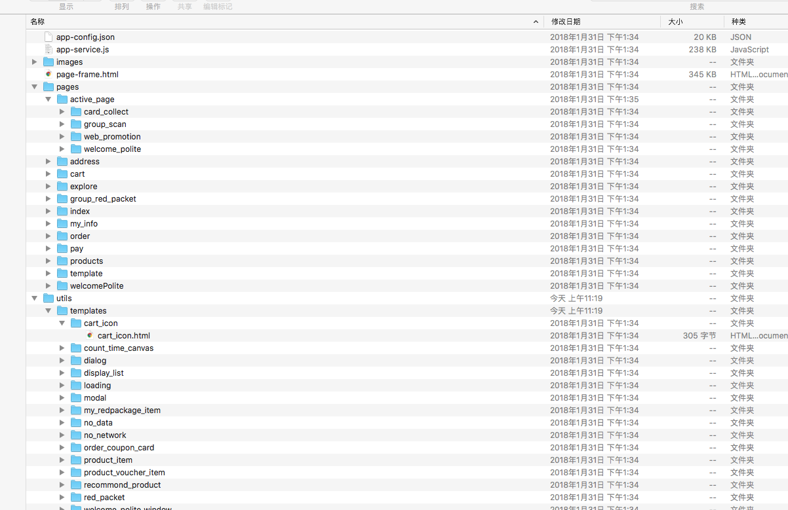

# 关于微信小程序安装包wxapkg

## 背景
2018年，随着小游戏的加入， 让小程序又火了一把。       
当然人们对于火的东西总想一探其究竟.       

## 小程序在微信上的形式
当我们利用微信的某个场景打开某个小程序的时候， 首次小程序会从网上下载，安装包最终会在微信的沙盒目录中wxapkg。       

至如如何知道小程序的安装包是wxapkg.       
1.微信漏洞       
通过抓包发现有cdn下载链接就是wxapkg       
2.通过逆向微信小程序模块       
进行深入分析其代码       

## 工具链
- mac       
- adb       
- 网易mumu模拟器       

## 过程
- 下载android sdk       
- 下载安装网易mumu模拟器       
- 在mumu中安装微信 登录微信       
- 另一个微信号发送一个你想分析的小程序的链接       
- 【cd adb目录（若adb不在环境变量中）】       
- adb connect 127.0.0.1:5555(7555) window和mac的端口不一样       
- adb shell 进入android控制台环境       
- su root进入       
- cd /data/data 进入沙盒目录       
- ls 查看当前目录文件   找到微信包名       
- cd com.tencent.mm   进入微信沙盒目录       
- find -name *.wxapkg      
- exit
- adb pull /data/data/com.tencent.mm/MicroMsg/030552b092dfdc3c7251184c7356578a/appbrand/pkg  .  将小程序包下载到当前目录     

## wxapkg
wxapkg是微信自定义的一种文件格式。       
是一种很简单的文件格式。通过解密wxapk我们可以获得在微信中真正运行的文件        

微信wxapkg解压          
> [wxapkg解压](unwxapkg.py)          

微信wxapkg分析:           
> [wxapkg分析](#)           

解压后图如下:
        

