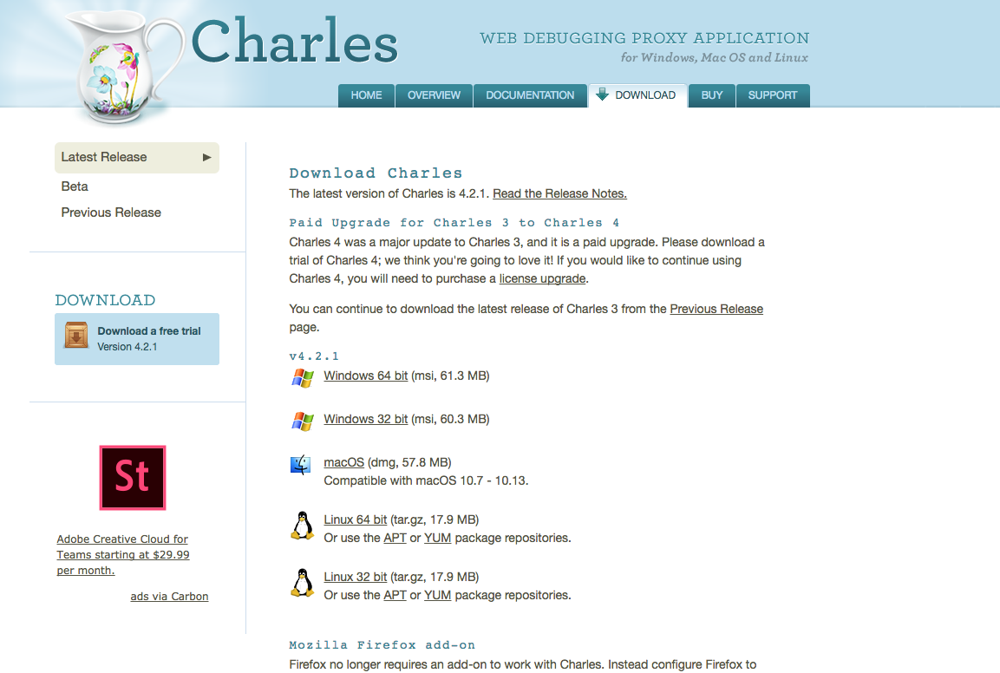
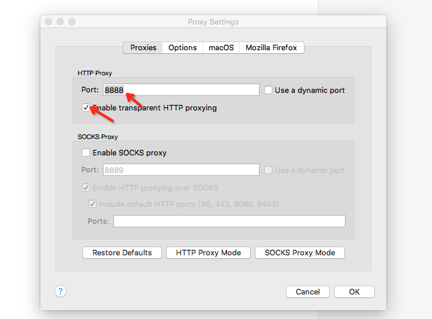
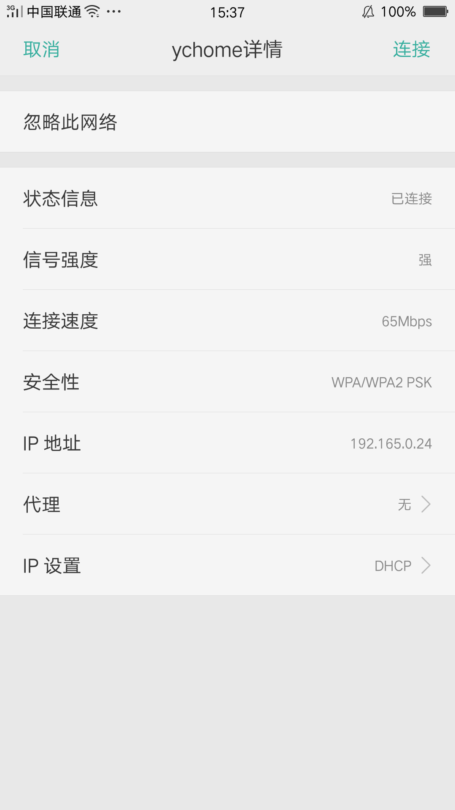
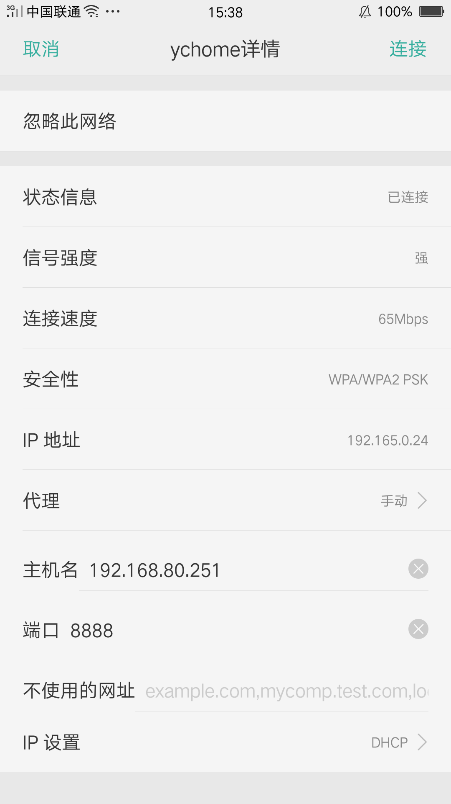
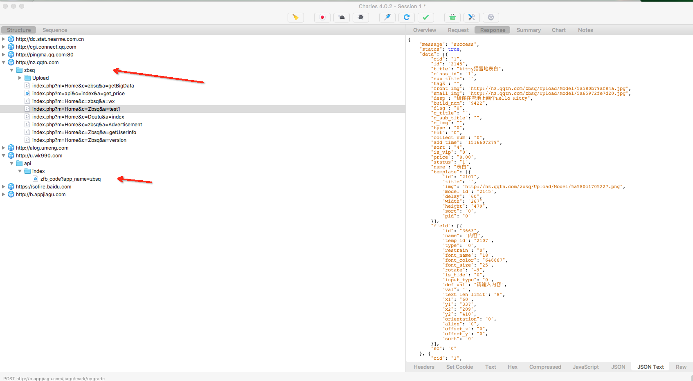
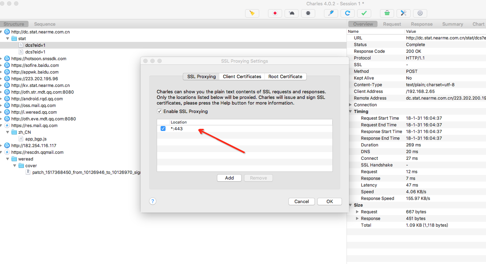

# http/https关于抓包

### 网络协议简介

我们都知道设备间通信需要定义**协议**， 而互联网中绝大部分场景都是使用的tcp/ip协议簇。

了解详情请看:
> [互联网tcp/ip协议簇](https://zh.wikipedia.org/wiki/TCP/IP%E5%8D%8F%E8%AE%AE%E6%97%8F)
> [http协议](https://zh.wikipedia.org/zh-hans/%E8%B6%85%E6%96%87%E6%9C%AC%E4%BC%A0%E8%BE%93%E5%8D%8F%E8%AE%AE)

### 关于抓包

#### 抓包原理
抓包原理我的理解就是一般有两种手段:          
1.一种是拦截网卡数据      
2.一种是拦截某个应用层网络协议(而用的最多的协议恐怕就是http协议了)        

#### 抓包工具

针对拦截网络数据截获整个tcp/ip协议层数据的：wireshark  （利用wireshark 需要对tcp或upd的协议的格式有一定了解）         
一个是拦截http协议的fiddler或者是Charles

#### Charles抓包

##### http抓包
这里我选择Charles进行抓包         
1.google搜索Charles      
2.进入官网下载Charles 选择对应操作系统版本          
          
3.打开Charles 选择Proxy-> Proxy Setting          
         
4.设置手机wifi代理到PC         
**这里需要注意的是 wifi与手机在一个互通的网络里面        
比如：手机接入wifi后，可以用ip访问PC上的网站**        

5.设置完成后 打开想抓包的某个软件: 比如：装逼神器       
- 装逼神器利用的就是http进入的数据传输        
- 看我们马上就可以获取装逼神器的数据        
         

##### https抓包           
https是建立在http这上的一层安全协TLS            

详细了解请看：      
> [https协议1](https://en.wikipedia.org/wiki/HTTPS)          
> [https协议2](http://www.ruanyifeng.com/blog/2014/02/ssl_tls.html)       
> [https协议3](http://www.ruanyifeng.com/blog/2014/09/illustration-ssl.html)      
 
https是要防止：    
（1） 窃听风险（eavesdropping）：第三方可以获知通信内容。       
（2） 篡改风险（tampering）：第三方可以修改通信内容。       
（3） 冒充风险（pretending）：第三方可以冒充他人身份参与通信。      

**怎么才能抓取https的信息呢！ 一般采取的中间人的方式**     

charles菜单：Help -> SSL Proxying ->      
- 1.PC端下载charles根证书 让其成为系统信任的证书      
- 2.ios/android下载根证书 让其成为系统信任的证书      
- 3.Proxy -> SSL Proxy Setting       
**这样就成为系统信任的条件，其代理过程让charles为我们自动完成      
接下就和http抓包过程一样了**       
       

